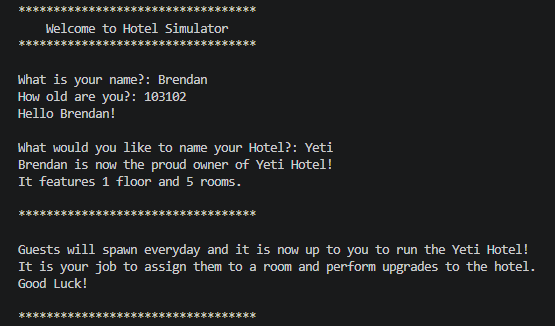

# Hotel.java -> those who know (but in C++)

A terminal-based hotel management simulator built in C++. Manage guests, handle room allocations, monitor stay durations, and dynamically expand your hotel with new rooms and floors.

**I'm to lazy to do try blocks at the moment so don't break it bruh**

---

## Overview

The game simulates running a multi-story hotel where:
- **Guests spawn daily** with randomized names and stay durations.
- You can **accept or deny** guests based on room availability and strategy.
- **Dynamic hotel upgrades** allow you to build new rooms or construct additional floors using your earnings.
- Built-in **memory management** tracks occupants dynamically using heap allocation and explicit checkouts.

---

## Features

- **Dynamic Room Grid:** Uses a 2D vector structure (`std::vector<std::vector<Room>>`) to represent floors and rooms.
- **Heap Memory Management:** Guest objects persist safely across multiple game loop iterations using heap pointers.
- **Endless Expansion System:** Build up to 5 rooms per floor before seamlessly constructing a new floor.
- **Economy Engine:** Dynamic pricing adjusts room cost and daily earning rates as your building grows.

---

## Class Structure

| Class | Description |
| :--- | :--- |
| `Player` | Stores player stats such as name, age, and current balance (`money`). |
| `Room` | Tracks room numbers, rates, occupancy status, and an `Occupant*` pointer. |
| `Occupant` | Holds guest details, including `name` and remaining `stayDuration`. |
| `Floor` | Manages structural parameters for floor expansions. |

---

## Getting Started

### Prerequisites

- A C++ compiler supporting **C++11** or later (GCC, Clang, or MSVC).

### Building and Running

1. **Clone or download the repository:**
   ```bash
    git clone https://github.com/NotBrendanB/Hotel
   ```
2. **Compile the Code:**
    ```bash
    g++ Hotel.cpp -o hotel_sim
3. **Run the Code:**
    ```bash
    hotel_sim.exe
    ```
---
## How to play

1. **Setup**: Enter your name, age, and preferred Hotel name.

2. **Assign Rooms**: When a guest spawns, enter a valid, unoccupied room number (e.g., 101) to place them, or type 0 to turn them away.

3. **Daily Progression**:

- Occupied rooms yield profits based on their daily rate.

- Guest durations decrement each day until checkout.

4. **Upgrades**: Spend earned funds to build additional rooms or construct upper floors.